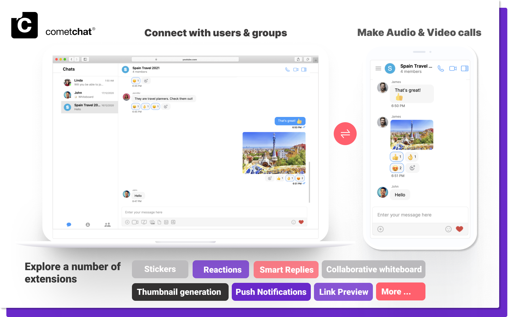

<div style="width:100%">
    <div style="width:50%;">
        <div align="center">
            
        </div>    
    </div>    
</div>

<br/><br/>

# React Chat UI Kit

<p align="left">
  <a href="https://github.com/cometchat-pro/javascript-react-chat-ui-kit/releases/" alt="Releases">
    
  </a>
  <a href="https://img.shields.io/github/languages/top/cometchat-pro/javascript-react-chat-ui-kit">
    
  </a>
  <a href="https://github.com/cometchat-pro/javascript-react-chat-app/stargazers">
    
  </a>
  <a href="https://twitter.com/CometChat">
    
  </a>
</p>

</br></br>

<div style="width:100%">
    <div style="width:50%; display:inline-block">
        <div align="center">
              
        </div>    
    </div>    
</div>

</br></br>

React Chat UI Kit is a collection of custom **UI Components** and **UI Screens** designed to build chat application with fully customizable UI. It is designed to avoid boilerplate code for building UI. 

___

## Prerequisites

Before you begin, ensure you have met the following requirements:

- React v16.14.0

- React DOM v16.14.0

___
## Installing React Chat UI Kit 

## 1. Setup

To install React UI Kit, you need to first register on CometChat Dashboard. <a href="https://app.cometchat.com/" target="_blank">Click here to sign up</a>

### i. Get your Application Keys

* Create a new app
* Head over to the Quick Start or API & Auth Keys section and note the `App ID`, `Auth Key`, and `Region`.

### ii. Add the CometChat Dependency

```javascript
  npm install @cometchat-pro/chat@2.1.5 --save
```

<br/>

## 2. Configure CometChat inside your app

### i. Initialize CometChat

The `init()` method initializes the settings required for CometChat.
We suggest calling the `init()` method on app startup, preferably in the `onCreate()` method of the Application class.

```javascript
const appID = "APP_ID";
const region = "REGION";
const appSetting = new CometChat.AppSettingsBuilder().subscribePresenceForAllUsers().setRegion(region).build();
CometChat.init(appID, appSetting).then(
  () => {
    console.log("Initialization completed successfully");
    // You can now call login function.
  },
  error => {
    console.log("Initialization failed with error:", error);
    // Check the reason for error and take appropriate action.
  }
);
```
**Note:**</br>
* Replace APP_ID and REGION with your CometChat `App ID` and `Region` in the above code.


### ii. Login your user

This method takes `UID` and `Auth Key` as input parameters and returns the User object containing all the information of the logged-in user..

```javascript
const authKey = "AUTH_KEY";
const uid = "SUPERHERO1";

CometChat.login(uid, authKey).then(
  user => {
    console.log("Login Successful:", { user });    
  },
  error => {
    console.log("Login failed with exception:", { error });    
  }
);
```
**Note:** </br>
* Replace `AUTH_KEY` with your CometChat `Auth Key` in the above code.

* We have setup 5 users for testing having UIDs: `SUPERHERO1`, `SUPERHERO2`, `SUPERHERO3`,`SUPERHERO4` and `SUPERHERO5`.

<br/>

## 3. Add UI Kit to your project

Clone this repository and copy the CometChat folder to your source folder

<br/>

## 4. Launch UI Unified

**UI Unified** is an option to launch a fully functional chat application using the UI Kit. In UI Unified all the UI Screens and UI Components are interlinked and work together to launch a fully functional chat on your website/application.

 ```html
 import {CometChatUnified} from "./CometChat";

 render() {

    return (<CometChatUnified />);
  }
 ```

<br/>

# Checkout our sample app

Visit our [React sample app] (https://github.com/cometchat-pro/javascript-react-chat-app) repo to run the React sample app.

<br/>

# Troubleshooting

- To read the full documentation on UI Kit integration visit our [Documentation](https://prodocs.cometchat.com/docs/react-ui-kit).

- Facing any issues while integrating or installing the UI Kit please <a href="https://app.cometchat.com/" target="_blank"> connect with us via real time support present in CometChat Dashboard.</a>

<br/>

# Contributors

Thanks to the following people who have contributed to this project:

[@priyadarshininadar](https://github.com/priyadarshininadar) <br>
[@ajaygajra](https://github.com/ajaygajra) <br>
[@prathamesh-majgaonkar](https://github.com/prathamesh-majgaonkar) <br>
[@mayur-bhandari](https://github.com/mayur-bhandari)


---

# Contact

Contact us via real time support present in [CometChat Dashboard.](https://app.cometchat.com/)

---

# License

---

This project uses the following [license](https://github.com/cometchat-pro/javascript-react-chat-ui-kit/blob/master/LICENSE).